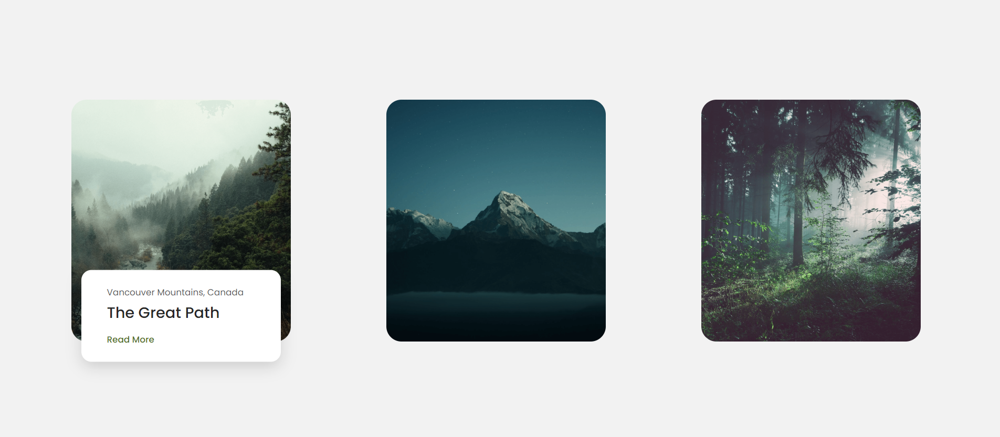

# Websites 1 

This mini website features a responsive design with interactive cards that highlight CSS transitions and transforms. It adapts gracefully to different screen sizes, with media queries, and employs Google Fonts for a sleek, modern look. The site offers a user-friendly experience with engaging hover animations that reveal more content.  

This project was built by following an excellent tutorial on Bedimcode.

